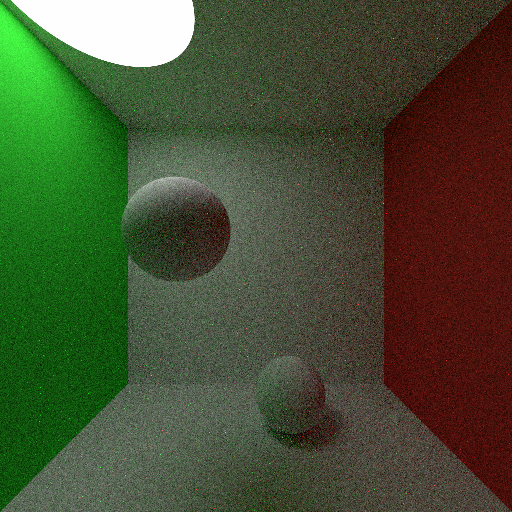

# CPP-PT

This is a simple pathtracer written in C++. It's meant to be a direct port of https://github.com/drcd1/rusty-pete.

## Current features:
- Pathtracing
- Sphere primitives
- Lambertian materials and emitters
- Linear to sRGB

*Sample render of a Cornell Box*

## Current TODO list:
- BVH
- Triangle Primitives
- Import
- Instanced Primitives
- MIS and Next Event Estimation
- Animated Triangle
- Motion Blur
